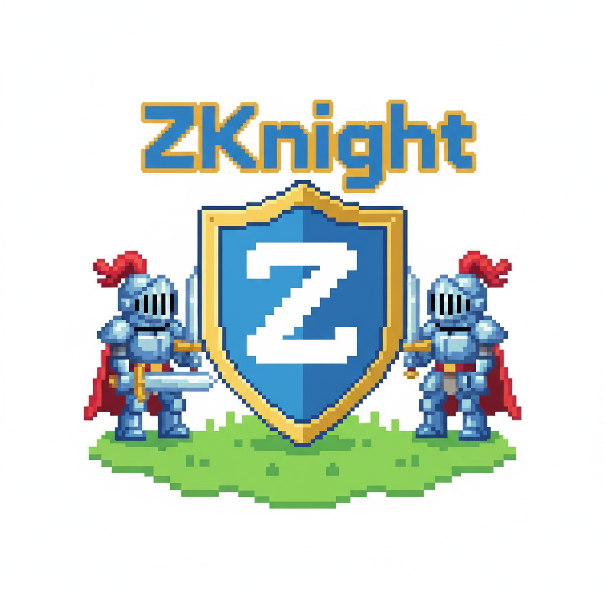

<p align="center">
  
</p>
<p align="center">
  <a href="https://zknight.wazowsky.id"><strong>▶ Play Now</strong></a> ·
  <a href="#zero-knowledge-proof-system">ZK Circuit</a> ·
  <a href="#building--deploying">Build Guide</a> ·
  <a href="#stellar-testnet-contract">Testnet Contract</a>
</p>
<p align="center">
  <a href="LICENSE"></a>
  
  
</p>

# ZKnight ♞

**ZKnight** is a competitive 2-player puzzle game where both players race to solve the same puzzle simultaneously. Every
move is verified on-chain using a zero-knowledge proof — the contract knows *that* you solved it, not *how*.

> *Control two knights with one input. Mirror their movements. Solve the puzzle before your opponent.*

---

## What is ZKnight?

### The Mirror Mechanic

Each player controls **two knights** on their own board. A single directional input moves both knights at the same
time — but in **strictly opposite directions** on both axes.

| Input   | Knight A         | Knight B         |
|---------|------------------|------------------|
| → Right | moves right (+x) | moves left (−x)  |
| ← Left  | moves left (−x)  | moves right (+x) |
| ↓ Down  | moves down (+y)  | moves up (−y)    |
| ↑ Up    | moves up (−y)    | moves down (+y)  |

### Win & Loss Conditions

**Win:** Both knights reach their designated goal tiles.

**Lose (puzzle resets):**

- Knight A and Knight B collide
- Either knight steps onto a Static TNT barrel
- Either knight steps onto a Moving TNT barrel (or a barrel moves into a knight)
- 5 minutes of real time elapse, or 512 ticks are used up

### Game Elements

| Element        | Behaviour                                                                                                                                           |
|----------------|-----------------------------------------------------------------------------------------------------------------------------------------------------|
| **Wall**       | Impassable. A knight blocked by a wall *stays in place* while the other still moves. This is the **wall anchor** — the core puzzle-solving tool.    |
| **Static TNT** | Fatal obstacle. Any knight that enters it triggers an explosion. Cannot be used as an anchor.                                                       |
| **Moving TNT** | Follows a fixed looping path, advancing one step each tick. Adds a timing dimension — players must account for barrel position when planning moves. |

### Puzzle Selection & Race

1. Player 1 creates an open game slot and shares the game ID.
2. Player 2 joins — the contract selects a puzzle via on-chain PRNG at join time. Neither player can predict it in
   advance.
3. Both players receive the identical puzzle and race to solve it locally in their browsers.
4. The first player to solve commits a hash of their solution on-chain immediately.
5. A ZK proof is generated in the background (~5–15 seconds).
6. Both players reveal their proofs; the contract verifies everything on-chain.

**Winner determination:**

1. Earliest commit timestamp wins.
2. Tie on timestamp → fewer ticks wins.
3. Equal tie → Player 1 wins by default.

---

## Zero-Knowledge Proof System

ZKnight uses **Circom + Groth16** on **BN254** — natively supported
by [Stellar's X-Ray protocol](https://stellar.org/blog/developers/announcing-stellar-x-ray-protocol-25) — to verify
player solutions without revealing the move sequence to the contract or opponent.

### What the Circuit Proves

The `zk/zknight.circom` circuit takes a private move sequence and a publicly verifiable puzzle layout, then proves:

- Every tick in the sequence is valid — no boundary violations, no explosions.
- Moving barrels advance deterministically each tick, independent of player input.
- At the final tick, both knights occupy their designated goal tiles.
- The proof is cryptographically bound to a specific puzzle ID and tick count.

### Circuit Parameters

| Parameter          | Value                                |
|--------------------|--------------------------------------|
| Grid               | 11 × 7 tiles                         |
| MAX_TICKS          | 512 (~5 min at 600 ms/tick)          |
| MAX_WALLS          | 26 per puzzle                        |
| MAX_STATIC_TNT     | 8 per puzzle                         |
| MAX_MOVING_BARRELS | 2 per puzzle                         |
| MAX_BARREL_PATH    | 16 steps per barrel                  |
| Constraints        | 520,214                              |
| Proof system       | Circom 2.1.x + Groth16 (BN254)       |
| Proving client     | snarkjs WASM in browser (Web Worker) |
| Proving time       | 10–20 seconds in browser             |

### Public and Private Inputs

All puzzle layout fields are **public inputs** — the Soroban contract reconstructs them deterministically from its
stored `Puzzle` struct and passes them directly to `verify_groth16()`. The move sequence is **private** — only the
player ever sees it.

**Public inputs (149 total):**

| Field                                                            | Count |
|------------------------------------------------------------------|-------|
| Grid dimensions (width, height)                                  | 2     |
| Knight A start position                                          | 2     |
| Knight B start position                                          | 2     |
| Goal A position                                                  | 2     |
| Goal B position                                                  | 2     |
| Wall positions, padded to 26                                     | 52    |
| Static TNT positions, padded to 8                                | 16    |
| Moving barrel paths (2 barrels × 16 steps)                       | 64    |
| Barrel path lengths                                              | 2     |
| Tick count                                                       | 1     |
| Puzzle ID                                                        | 1     |
| Circuit outputs (`out_puzzle_id`, `out_tick_count`, `out_win=1`) | 3     |

**Private input:**

- `moves[512]` — full tick sequence: `0=Up  1=Down  2=Left  3=Right  4=NoOp`

### Per-Tick Circuit Logic (runs 512 times)

Each tick executes in this order:

```
1. Advance all moving barrels one step along their looping path
2. Compute intended next positions from the move direction (A and B mirrored)
3. Clamp positions to grid boundaries
4. Wall blocking: if A's or B's next position matches a wall, that knight stays in place
5. Collision assertions: A ≠ B, neither knight on a barrel or static TNT
6. Advance knight state
```

After all 512 ticks, the circuit asserts the win condition:

```
knightA_final == goal_a  AND  knightB_final == goal_b
```

### Commit / Reveal Pattern in the Soroban Contract

The contract uses a two-step pattern so players can prove they solved the puzzle *first* without waiting for proof
generation to complete.

**Step 1 — `commit_solve`**

The moment a player solves the puzzle locally, they submit `sha256(preimage)` to the contract. This timestamps the win
on-chain in a single fast transaction — no proof required yet.

**Step 2 — `reveal_solve`**

Once snarkjs finishes generating the proof (~10–20s), the player submits:

- 32-byte preimage (opens the commitment)
- 256-byte Groth16 proof seal
- Tick count

The contract then:

1. Verifies `sha256(preimage)` matches the stored commitment.
2. Reconstructs the exact 149-element public input vector from the stored `Puzzle`.
3. Calls `verify_groth16()` using the embedded verification key (native BN254 via Stellar X-Ray Protocol 25).
4. Records the tick count for winner determination.
5. If both players have revealed, applies the winner rules and sets `status = Finished`.

### Proof Encoding (Circom → Soroban)

snarkjs outputs the G2 point B in `c0||c1` order. Stellar's BN254 SDK expects `c1||c0`. The proof is re-encoded before
submission:

```
Bytes [0..64]    A — G1 point, x||y big-endian (no swap)
Bytes [64..192]  B — G2 point, SWAPPED: x_im||x_re||y_im||y_re
Bytes [192..256] C — G1 point, x||y big-endian (no swap)
```

Total: **256 bytes**. Public inputs are not included in the proof bytes — the contract reconstructs them independently
from on-chain puzzle data.

---

## Building & Deploying

### Prerequisites

- [Rust](https://rustup.rs/) with `wasm32-unknown-unknown` target
- [Stellar CLI](https://developers.stellar.org/docs/tools/stellar-cli) ≥ v25 (Protocol 25 / X-Ray required for BN254)
- [Bun](https://bun.sh/) ≥ 1.x
- [Node.js](https://nodejs.org/) ≥ 18
- [circom](https://docs.circom.io/getting-started/installation/) 2.2.x
- snarkjs ≥ 0.7.6

```bash
# Install Rust wasm target
rustup target add wasm32-unknown-unknown

# Install snarkjs globally
npm install -g snarkjs
```

### 1. Install Project Dependencies

```bash
bun install
cd zknight-frontend && bun install && cd ..
```

### 2. Build the ZK Circuit

The compiled circuit, trusted setup keys (`zknight_final.zkey`), and verification key (`vk.json`) are included in `zk/`.
Re-run the trusted setup only if the circuit changes.

```bash
cd zk

# Compile the circuit
circom zknight.circom --r1cs --wasm --sym --output ./build
```

**Trusted setup — only needed after circuit changes:**

```bash
# Phase 1: Powers of Tau  (2^19 = 524,288 > 520,214 constraints — very tight fit; use 2^20 if circuit grows)
snarkjs powersoftau new bn128 19 pot19_0000.ptau
snarkjs powersoftau contribute pot19_0000.ptau pot19_final.ptau \
    --name="ZKnight Setup" -e="your entropy here"
snarkjs powersoftau prepare phase2 pot19_final.ptau pot19_pp.ptau

# Phase 2: Circuit-specific setup
snarkjs groth16 setup build/zknight.r1cs pot19_pp.ptau zknight_0000.zkey
snarkjs zkey contribute zknight_0000.zkey zknight_final.zkey \
    --name="Contributor" -e="more entropy here"

# Export verification key
snarkjs zkey export verificationkey zknight_final.zkey vk.json

# Convert VK to Soroban byte format → regenerates contracts/zknight/src/verification_key.rs
node convert_vk_to_bytes.js
```

**Test a proof locally before deploying:**

```bash
snarkjs groth16 fullprove input.json build/zknight_js/zknight.wasm zknight_final.zkey proof.json public.json
snarkjs groth16 verify vk.json public.json proof.json
```

**Copy prover assets into the frontend:**

```bash
# Only the WASM goes into public/ — the zkey is served from the CDN (see prove.worker.js ZKEY_PATH)
cp zk/build/zknight_js/zknight.wasm zknight-frontend/public/zk/
```

> The `zknight_final.zkey` (~222 MB) is **not** committed or copied to `public/`.
> It is served from a CDN and stored in the
> browser's **Cache API** (`zknight-zkey-v1`) on first load — subsequent visits serve it instantly
> without re-downloading.
> To override the CDN URL, set `window.__ZKEY_URL__` in `public/game-studio-config.js`.
> The worker is cache-busted on every build via a `?v=<timestamp>` query string injected by
> `vite.config.ts`, ensuring browsers always pick up the latest worker after a deploy.

### 3. Build & Deploy the Soroban Contract

```bash
# Build all contracts
bun run build

# Deploy to Stellar testnet
bun run deploy

# Generate TypeScript bindings from the deployed contract
bun run bindings

# Or run the full pipeline in one step
bun run setup
```

After deployment, update the contract ID in `zknight-frontend/public/game-studio-config.js`.

### 4. Seed Puzzles

Push the initial puzzle pool to the deployed contract:

```bash
bun run scripts/seed-puzzles.ts
```

### 5. Run the Frontend Locally

```bash
bun run dev:game zknight
# or
cd zknight-frontend && bun run dev
```

### 6. Build for Production

```bash
bun run publish zknight --build
```

### Command Reference

```bash
bun run setup                        # Full pipeline: build + deploy + bindings
bun run build                        # Build all Soroban contracts
bun run deploy                       # Deploy to Stellar testnet
bun run bindings                     # Regenerate TypeScript bindings
bun run dev:game zknight             # Run frontend with live reload
bun run publish zknight --build      # Production frontend build
```

---

## Stellar Testnet Contract

| Contract | Address                                                    |
|----------|------------------------------------------------------------|
| ZKnight  | `CAL3YZ4YGUSGFLUGFAUTOM3RJZ6DZ4DS3SQNNC7AMPJHSKZ72S2JA355` |

Network: **Stellar Testnet** · Protocol 25 (X-Ray)

---

## License

[MIT](LICENSE)
